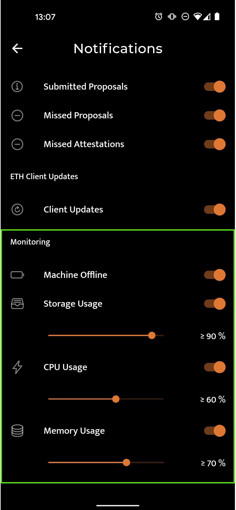

# 📊 Beginner: CSM Widget, EthSeer, Beaconcha.in

To get rewards on CSM your validators, their performance must be equal to the average performance of the network minus 5% during the monitoring frame of 28 days. That makes it very easy to receive rewards, and it's even easier to check how your operator is doing.

## Snapshot Performance

Go to the [monitoring](https://csm.lido.fi/monitoring) tab in the CSM UI to see the overall performance of your Node Operator. Note that only keys above the threshold will receive rewards at the end of the frame.

<figure><figcaption></figcaption></figure>

## EthSeer: Performance vs Network Average

The easiest way to see the performance of your keys against the network average is via [EthSeer](https://ethseer.io/). To see them:

1. Head to the [monitoring](https://csm.lido.fi/monitoring) and click on EthSeer under `External dashboards`. This will open the view of your operator.
2. Scroll down and click in the validator number you want to monitor.
3. There you will see information including Source, Target and Head correctness from your validator against the network for the selected period of time.

<figure><figcaption></figcaption></figure>

## Beaconcha.in App

Download the Beaconcha.in mobile app and use it for on-the-go monitoring & alerts.

* **1st tab:** Summary of validators in your watchlist
* **2nd tab:** Search for your Validator ID or public key and check the flag on the right to add it to your watchlist
* **3rd tab:**  View more device level diagnostics like CPU, RAM, disk space, networking throughput, peer count etc
* **4th tab:** Configure your notification preferences for your validator on the settings


**Pro tip:** If you are running all of your validator keys on a single machine, adding just 1 validator ID/pubkey to your beaconcha.in watchlist will be sufficient.


.webp>).webp>)
